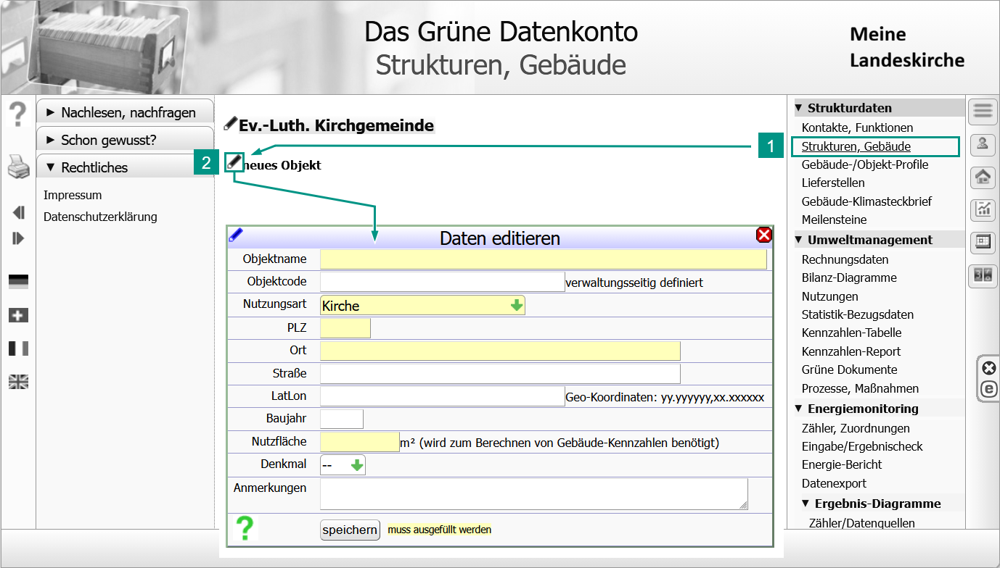
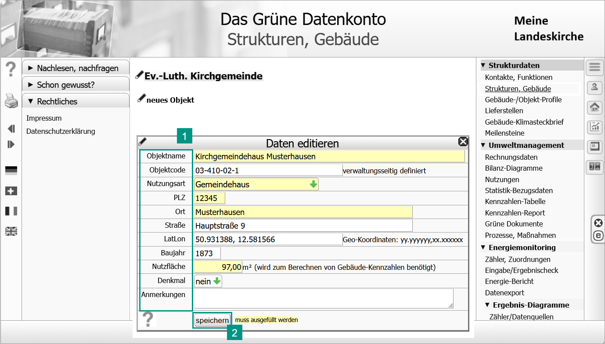
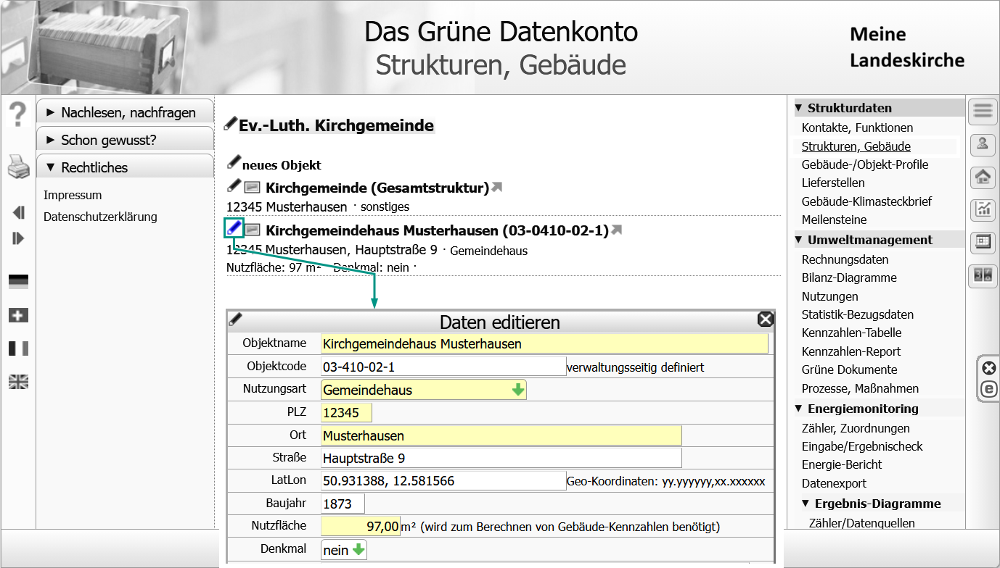
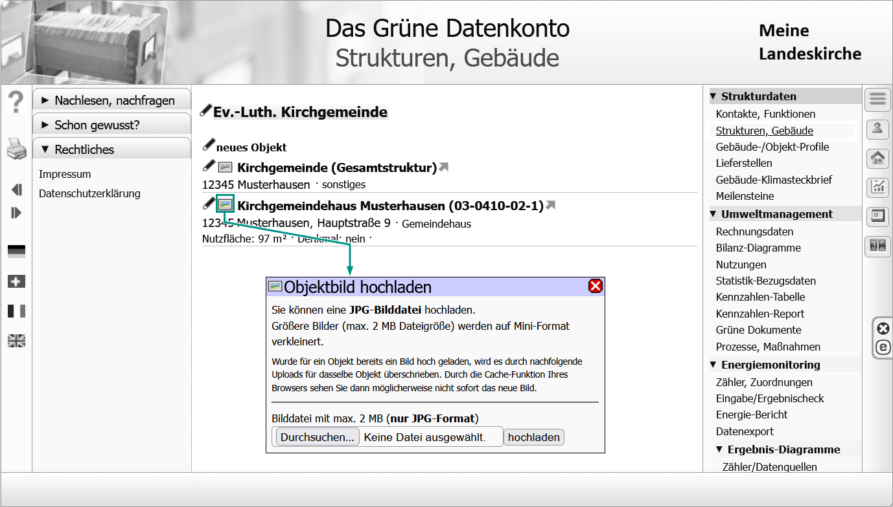
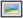

# Objekt anlegen

!!! tip "{{ term_object }}: {{ def_object }}"

    **Objekt der technischen Infrastruktur**  
    {{ def_object_tech }}  

    **Objekt der organisatorischen Struktur**  
    {{ def_object_org }}  

<!-- Buttons für die 4 Optionen -->

  <button onclick="toggleContainer('strukturen-container', 'strukturen-button')" class="toggle-button" id="strukturen-button">1. {{ function_call }}</button>
  <button onclick="toggleContainer('objekt-container', 'objekt-button')" class="toggle-button" id="objekt-button">2. {{ data_input }}</button>
  <button onclick="toggleContainer('daten-container', 'daten-button')" class="toggle-button" id="daten-button">{{ optional }}{{ data_edit }}</button>
  <button onclick="toggleContainer('bild-container', 'bild-button')" class="toggle-button" id="bild-button">{{ optional }}{{ image_add }}</button>

<!-- Container für die Inhalte (nur der erste ist sichtbar) -->

    

    <ol>
      <li>{{ action_openpage }}<strong>{{ men_item_structure }}</strong></li>
      <li>{{action_callfunction}}<strong>{{new_object}}</strong> | <i>{{result_dialog_appears}}<strong>{{dialog_header_editdata}}</strong></i></li>
    </ol>      

  

  
Alle gelb hinterlegten Felder sind Pflichtfelder und müssen ausgefüllt werden. Alle anderen Felder sind optional. Sie können für die weitere Arbeit zunächst leer bleiben, nachträglich eingetragen oder geändert werden.
 
  
Bist du mit den Eingaben fertig, klicke auf <strong>[Speichern]</strong>.  <i>Das Objekt erscheint in der Liste auf dieser Seite.</i>

  

  <h3>{{ struct_head_parameters }}</h3>
 

  

    
{{ object_name }}

    
{{ object_name_definition }}

  

  

    
{{ object_code }}

    
{{ object_code_definition }} 
    <strong>{{ object_code_key }}</strong>

    
<strong>Codeziffer für den Gebäudetyp</strong > 01 Kirche; 02 Gemeindehaus; 03 Kindergarten; 04 Verwaltung; 05 Gemeindezentrum; 06 Wohnhaus; 07 Gästehaus; 08 Schule; 09 Werkstatt; 10 Tagesstätte/-einrichtung; 11 Stationäre Einrichtung; 12 Krankenhaus; 13 Außenanlage; 14 sonstiges; 15 Kapelle; 16 Pfarrhaus; 36 Gewerbe; 37 KiTa (Betriebsträgerschaft); 38 Friedhof; 39 Friedhof (Betriebsträgerschaft)

  

  

    
{{ object_type }}

    
{{ object_type_definition }}

    
<strong>Für ein Objekt der organisatorischen Struktur: "sonstiges" </strong>

  

  

    
{{ object_plz }} / {{ object_city }} / {{ object_street}}

    
{{ object_plz_definition }}

  

  

    
{{ object_coordinates }}

    
{{ object_coordinates_definition }}

  

  

    
{{ object_built }}

    
{{ object_built_definition }}

  

  

    
{{ object_area }}

    
{{ object_area_definition }}

  

  

    
{{ object_historic }}

    
{{ object_historic_definition }}

  

  

    
{{ object_annotation }}

    
{{ object_annotation_definition }}

  

  

  
Um die Daten für ein Objekt nachträglich zu ändern, klickst du auf das Symbol .  <i>{{result_dialog_appears}}<strong>{{dialog_header_editdata}}</strong></i>

  

  <h3>{{ struct_head_parameters }}</h3>

  

  
Um dem dem Objekt ein Foto zuzuordnen, klickst du auf das Symbol .

<!-- JavaScript-Funktion zum Toggle -->

<!-- CSS für die Buttons und Container

-->
