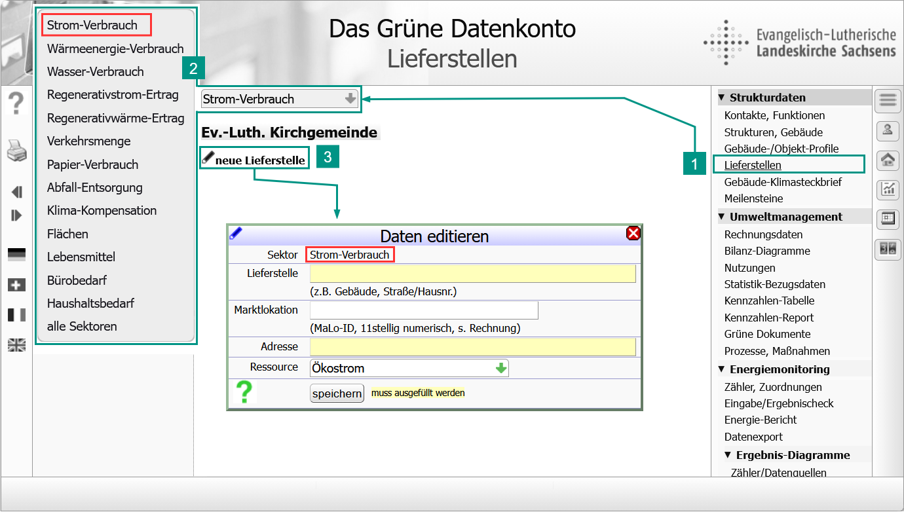
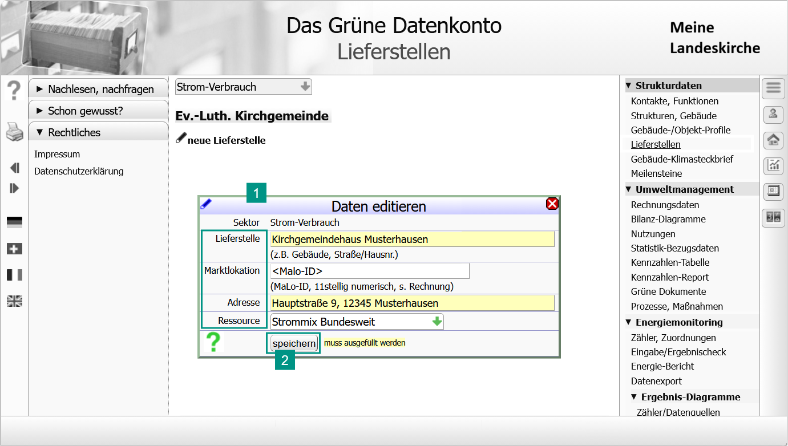
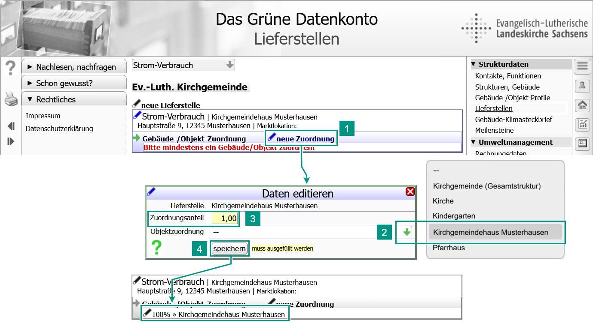
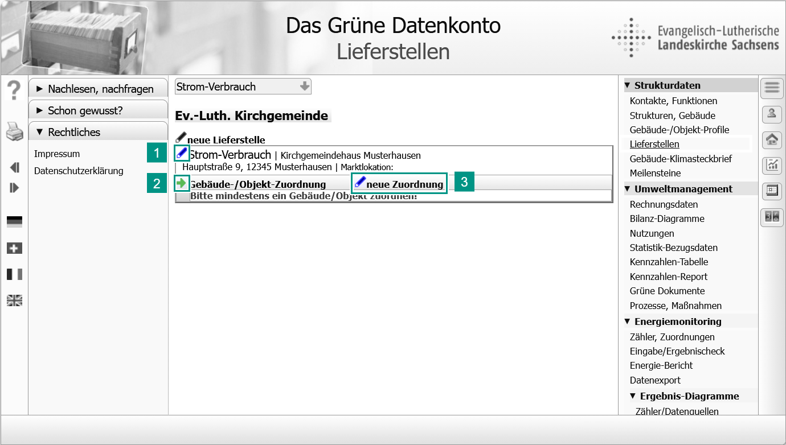

!!! tip "{{ term_deliverypoint }}: {{ def_deliverypoint }}"

    **Lieferstelle der technischen Infrastruktur**  
    {{ def_deliverypoint_tech }}  

    **Lieferstelle der organisatorischen Struktur**  
    {{ def_deliverypoint_org }}  

<!-- Buttons für die 4 Optionen -->

  <button onclick="toggleContainer('container-1', 'button1')" class="toggle-button" id="button-1">1. {{ function_call }}</button>
  <button onclick="toggleContainer('container-2', 'button-2')" class="toggle-button" id="button-2">2. {{ data_input }}</button>
  <button onclick="toggleContainer('container-3', 'button-3')" class="toggle-button" id="button-3">3. {{ object_shares_definition }}</button>
  <button onclick="toggleContainer('container-4', 'button-4')" class="toggle-button" id="button-4">{{ optional }}{{ data_edit }}</button>

<!-- Container für die Inhalte (nur der erste ist sichtbar) -->

    

    <ol>
      <li>{{ action_openpage }}<strong>{{ men_item_deliverypoints }}</strong></li>
      <li>Wähle den Verbrauchssektor.  
      Für elektrische Heizungsanlagen mit eigener Zähleinrichtung wähle die Ressource <strong>{{ waerme }}</strong>. </li>
      <li>{{action_callfunction}}<strong>{{new_deliverypoint}}</strong> | <i>{{result_dialog_appears}}<strong>{{dialog_header_editdata}}</strong></i></li>
    </ol>      

  

    
Alle gelb hinterlegten Felder sind Pflichtfelder und müssen ausgefüllt werden, die Daten in den anderen Felder kannst du später ergänzen. 
 
    
Bist du mit den Eingaben fertig, klicke auf <strong>[Speichern]</strong>.  <i>Die neue Lieferstelle erscheint in der Liste auf dieser Seite.</i>

    

    <h3>{{ struct_head_parameters }}</h3>

    

      
{{ deliverypoint_name }}

      
{{ deliverypoint_name_definition }}

    

    

    
{{ deliverypoint_marketlocation }}

    
{{ deliverypoint_marketlocation_definition }}     
    

    

    
{{ deliverypoint_adress }}

    
{{ deliverypoint_adress_definition }}
    
    

    

    
{{ deliverypoint_resource }}

    
{{ deliverypoint_resource_definition }}

    

  

  
Nun teilst du der Lieferstelle mit, welche Objekte sie versorgt und wie hoch der Anteil des jeweiligen Objekts am Verbrauch über diese Lieferstelle ist.  
  Eine Lieferstelle kann mehrere Objekte versorgen. Jede Lieferstelle muss mindestens ein Objekt versorgen (ansonsten wäre die Lieferstelle sinnlos). 

  
So ordnest du der Lieferstelle ein Objekt zu:

  <ol>
    <li>Im Datensatz der Lieferstelle: Klicke auf:  <strong>neue Zuordnung</strong>.  <i>{{result_dialog_appears}}<strong>{{dialog_header_editdata}}</strong></i></li>
    <li>Wähle das zu versorgende Objekt: <strong>{{ deliverypoint_assignment_object}}.</strong> <i>Die Auswahl zeigt alle deine zuvor definierten Objekte. Durch Mausklick ordnest du das gewählte Objekt der Lieferstelle zu.</i></li>
    <li> Definiere den Anteil der Ressource den das Objekt aus der Lieferstelle bezieht. Gib den Wert als Faktor an (0 ... 1).  <strong>An dieser Stelle berücksichtigst du den Anteil fremdgenutzter (vermieteter Gebäudeteile).</strong></li> 
    <li>Klicke auf <strong>[Speichern]</strong>.  <i>Das gewählte Objekt ist mit der Lieferstelle verbunden.</i></li>
    <li>Versorgt die Lieferstelle weitere Objekte, wiederhole die Schritte 1 bis 4. Die Summe der Zuordnungsanteile darf nicht größer als 1 sein.</li>
  </ol>     

  

  
Mit diesen Möglichkeiten kannst du die Lieferstelle nachträglich bearbeiten:

  <ol>
    <li>Benennung und Daten der Lieferstelle ändern.</li>
    <li>Die Objektzuordnung der Lieferstelle ändern (z. B. Wert des Zuordnungsanteils), ein anderes Objekt zuordnen oder die Zuordnung löschen.</li>
    <li>Der Lieferstelle ein weiteres Objekt zuordnen.</li>
  </ol>

<!-- JavaScript-Funktion zum Toggle -->

 

