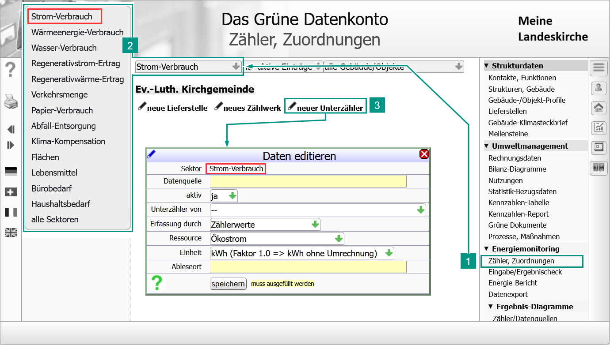
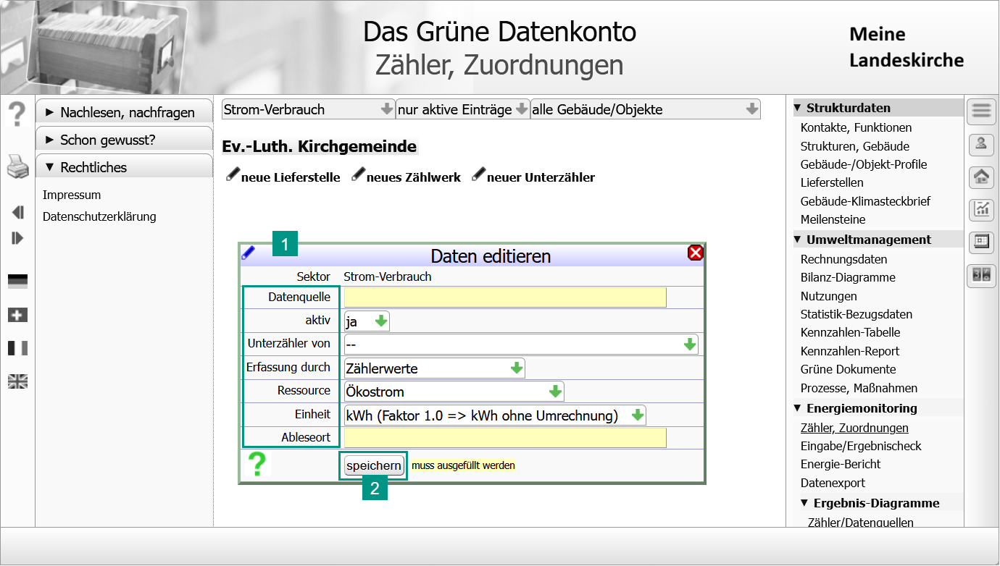
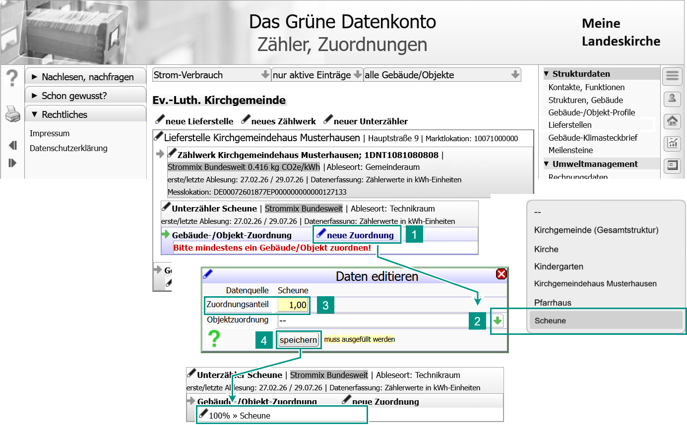
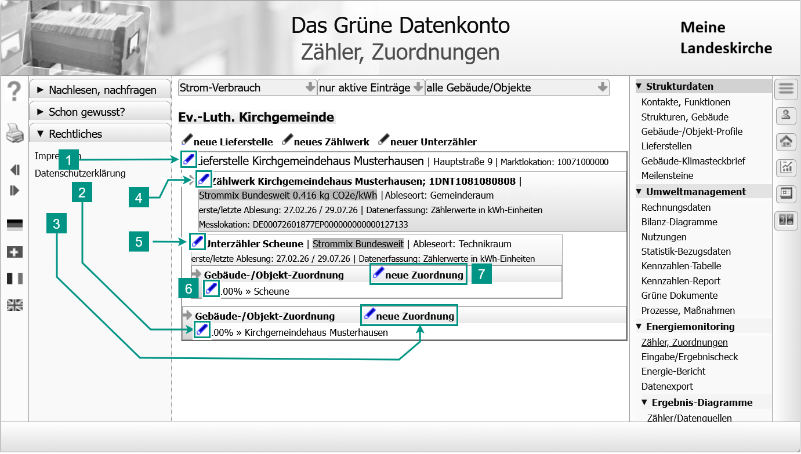

!!! tip "{{ term_submeter }}: {{ def_submeter }}"

    **Unterzähler in der technischen Infrastruktur**  
    {{ def_submeter_tech }}  

    **Unterzähler in der organisatorischen Struktur**  
    {{ def_submeter_org }}  

<!-- Buttons für die 4 Optionen -->

  <button onclick="toggleContainer('container-1', 'button-1')" class="toggle-button" id="button-1">1. {{ function_call }}</button>
  <button onclick="toggleContainer('container-2', 'button-2')" class="toggle-button" id="button-2">2. {{ data_input }}</button>
  <button onclick="toggleContainer('container-3', 'button-3')" class="toggle-button" id="button-3">3. {{ object_shares_definition }}</button>
  <button onclick="toggleContainer('container-4', 'button-4')" class="toggle-button" id="button-4">{{ optional }}{{ data_edit }}</button>

<!-- Container für die Inhalte (nur der erste ist sichtbar) -->

    

    <ol>
      <li>{{ action_openpage }}<strong>{{ men_item_meters }}</strong></li>
      <li>Wähle den Verbrauchssektor.  
      Für elektrische Heizungsanlagen mit eigener Zähleinrichtung wähle die Ressource <strong>{{ waerme }}</strong>. </li>
      <li>{{action_callfunction}}<strong>{{new_submeter}}</strong> | <i>{{result_dialog_appears}}<strong>{{dialog_header_editdata}}</strong></i></li>
    </ol>      

  

    
Alle gelb hinterlegten Felder sind Pflichtfelder und müssen ausgefüllt werden, die Daten in den anderen Felder kannst du später ergänzen. 
 
    
Bist du mit den Eingaben fertig, klicke auf <strong>[Speichern]</strong>.  <i>Der neue Zähler erscheint in der Liste auf dieser Seite.</i>

    

    <h3>{{ struct_head_parameters }}</h3>
    
{{ dialog_according_to_sector }}

    

      <button onclick="toggleContainer('strom-container', 'strom-button')" class="toggle-button active-button" id="strom-button">{{ strom }}</button>
      <button onclick="toggleContainer('waerme-container', 'waerme-button')" class="toggle-button" id="waerme-button">{{ waerme }}</button>
      <button onclick="toggleContainer('wasser-container', 'wasser-button')" class="toggle-button" id="wasser-button">{{ wasser }}</button>
      <button onclick="toggleContainer('regstrom_ertrag-container', 'regstrom_ertrag-button')" class="toggle-button" id="regstrom_ertrag-button">{{ regstrom_ertrag }}</button>
      <button onclick="toggleContainer('regwaerme_ertrag-container', 'regwaerme_ertrag-button')" class="toggle-button" id="regwaerme_ertrag-button">{{ regwaerme_ertrag }}</button>
      <button onclick="toggleContainer('verkehr-container', 'verkehr-button')" class="toggle-button" id="verkehr-button">{{ verkehr }}</button>
      <button onclick="toggleContainer('papier-container', 'papier-button')" class="toggle-button" id="papier-button">{{ papier }}</button>
      <button onclick="toggleContainer('abfall-container', 'abfall-button')" class="toggle-button" id="abfall-button">{{ abfall }}</button>
      <button onclick="toggleContainer('klima_komp-container', 'klima_komp-button')" class="toggle-button" id="klima_komp-button">{{ klima_komp }}</button>
      <button onclick="toggleContainer('flaechen-container', 'flaechen-button')" class="toggle-button" id="flaechen-button">{{ flaechen }}</button>
      <button onclick="toggleContainer('lebensmittel-container', 'lebensmittel-button')" class="toggle-button" id="lebensmittel-button">{{ lebensmittel }}</button>
      <button onclick="toggleContainer('buerobedarf-container', 'buerobedarf-button')" class="toggle-button" id="buerobedarf-button">{{ buerobedarf }}</button>
      <button onclick="toggleContainer('haushaltsbedarf-container', 'haushaltsbedarf-button')" class="toggle-button" id="haushaltsbedarf-button">{{ haushaltsbedarf }}</button>
   

<!-- Container für alle Termini (standardmäßig ausgeblendet) -->

  <!-- <h3>{{ strom }}</h3> -->
  

  

    
{{ meter_datasource }}

    
{{ meter_datasource_definition }}
      
  

  
      
    
{{ meter_activitystatus }}

    
{{ meter_activitystatus_definition }}

    
{{ meter_activitystatus_usage }}

  

  

    
{{ submeter_meter_assignment }}

    
{{ submeter_meter_assignment_definition }}
      
  

    

    
{{ meter_recordingmethod }}

    
{{ meter_recordingmethod_definition }}
  
    {{ include_file("snippets/meter_recordingmethod_types_table.md") }}            
  

  

    
{{ meter_resource }}

    
{{ meter_resource_definition }}

    {{ include_file("snippets/resources_strom.md") }}        
  

   

    
{{ meter_unit }}

    
{{ meter_unit_definition }}
      
    {{ include_file("snippets/units_strom.md") }}        
  

  

    
{{ meter_position }}

    
{{ meter_position_definition }}
      
  

  <!--  <h3>{{ waerme }}</h3> -->
  

  

    
{{ meter_datasource }}

    
{{ meter_datasource_definition }}
      
  

  
      
    
{{ meter_activitystatus }}

    
{{ meter_activitystatus_definition }}

    
{{ meter_activitystatus_usage }}

  

  

    
{{ submeter_meter_assignment }}

    
{{ submeter_meter_assignment_definition }}
      
  

  

    
{{ meter_recordingmethod }}

    
{{ meter_recordingmethod_definition }}
          
    {{ include_file("snippets/meter_recordingmethod_types_table.md") }}
  

  

    
{{ meter_resource }}

    
{{ meter_resource_definition }}

    {{ include_file("snippets/resources_waerme.md") }}         
  

   

    
{{ meter_unit }}

    
{{ meter_unit_definition }}
  
    {{ include_file("snippets/units_waerme.md") }}             
  

  

    
{{ meter_position }}

    
{{ meter_position_definition }}
      
  

  <!-- <h3>{{ wasser }}</h3> -->
  

  

    
{{ meter_datasource }}

    
{{ meter_datasource_definition }}
      
  

  
      
    
{{ meter_activitystatus }}

    
{{ meter_activitystatus_definition }}

    
{{ meter_activitystatus_usage }}

  

  

    
{{ submeter_meter_assignment }}

    
{{ submeter_meter_assignment_definition }}
      
  

  

    
{{ meter_recordingmethod }}

    
{{ meter_recordingmethod_definition }}
          
    {{ include_file("snippets/meter_recordingmethod_types_table.md") }}
  

  

    
{{ meter_resource }}

    
{{ meter_resource_definition }}

    {{ include_file("snippets/resources_wasser.md") }}          
  

  <!-- 

    
{{ meter_unit }}

    
{{ meter_unit_definition }}
      
  
 -->
  

    
{{ meter_position }}

    
{{ meter_position_definition }}
      
  

  <!-- <h3>{{ regstrom_ertrag }}</h3> -->
  

  

    
{{ meter_datasource }}

    
{{ meter_datasource_definition }}
      
  

  
      
    
{{ meter_activitystatus }}

    
{{ meter_activitystatus_definition }}

    
{{ meter_activitystatus_usage }}

  

  

    
{{ submeter_meter_assignment }}

    
{{ submeter_meter_assignment_definition }}
      
  

  

    
{{ meter_recordingmethod }}

    
{{ meter_recordingmethod_definition }}
          
    {{ include_file("snippets/meter_recordingmethod_types_table.md") }}
  

  <!-- 

    
{{ meter_resource }}

    
{{ meter_resource_definition }}
      
  
 -->
  

    
{{ meter_unit }}

    
{{ meter_unit_definition }}

    {{ include_file("snippets/units_regstrom-ertrag.md") }}               
  

  

    
{{ meter_position }}

    
{{ meter_position_definition }}
      
  
 

  <!-- <h3>{{ regwaerme_ertrag }}</h3> -->
  

  

    
{{ meter_datasource }}

    
{{ meter_datasource_definition }}
      
  

  
      
    
{{ meter_activitystatus }}

    
{{ meter_activitystatus_definition }}

    
{{ meter_activitystatus_usage }}

  

  

    
{{ submeter_meter_assignment }}

    
{{ submeter_meter_assignment_definition }}
      
  

  

    
{{ meter_recordingmethod }}

    
{{ meter_recordingmethod_definition }}
          
    {{ include_file("snippets/meter_recordingmethod_types_table.md") }}
  

  

    
{{ meter_resource }}

    
{{ meter_resource_definition }}
      
  

  

    
{{ meter_unit }}

    
{{ meter_unit_definition }}
  
    {{ include_file("snippets/units_regwaerme-ertrag.md") }}    
  

  

    
{{ meter_position }}

    
{{ meter_position_definition }}
      
  

  <!-- <h3>{{ verkehr }}</h3> -->
  

  

    
{{ meter_datasource }}

    
{{ meter_datasource_definition }}
      
  

  
      
    
{{ meter_activitystatus }}

    
{{ meter_activitystatus_definition }}

    
{{ meter_activitystatus_usage }}

  

  

    
{{ submeter_meter_assignment }}

    
{{ submeter_meter_assignment_definition }}
      
  

  

    
{{ meter_recordingmethod }}

    
{{ meter_recordingmethod_definition }}
          
    {{ include_file("snippets/meter_recordingmethod_types_table.md") }}
  

  

    
{{ meter_resource }}

    
{{ meter_resource_definition }}

    {{ include_file("snippets/resources_wasser.md") }}       
  

  

    
{{ meter_unit }}

    
{{ meter_unit_definition }}

    {{ include_file("snippets/units_verkehr.md") }}      
  

  

    
{{ meter_position }}

    
{{ meter_position_definition }}
      
  

  <!-- <h3>{{ papier }}</h3> -->
  

  

    
{{ meter_datasource }}

    
{{ meter_datasource_definition }}
      
  

  
      
    
{{ meter_activitystatus }}

    
{{ meter_activitystatus_definition }}

    
{{ meter_activitystatus_usage }}

  

  

    
{{ submeter_meter_assignment }}

    
{{ submeter_meter_assignment_definition }}
      
  

  

    
{{ meter_recordingmethod }}

    
{{ meter_recordingmethod_definition }}
          
    {{ include_file("snippets/meter_recordingmethod_types_table.md") }}
  

  

    
{{ meter_resource }}

    
{{ meter_resource_definition }}
 
    {{ include_file("snippets/resources_wasser.md") }}     
  

  

    
{{ meter_unit }}

    
{{ meter_unit_definition }}

    {{ include_file("snippets/units_papier.md") }}      
  

  

    
{{ meter_position }}

    
{{ meter_position_definition }}
      
  

  <!-- <h3>{{ abfall }}</h3> -->
  

  

    
{{ meter_datasource }}

    
{{ meter_datasource_definition }}
      
  

  
      
    
{{ meter_activitystatus }}

    
{{ meter_activitystatus_definition }}

    
{{ meter_activitystatus_usage }}

  

  

    
{{ submeter_meter_assignment }}

    
{{ submeter_meter_assignment_definition }}
      
  

  

    
{{ meter_recordingmethod }}

    
{{ meter_recordingmethod_definition }}
          
    {{ include_file("snippets/meter_recordingmethod_types_table.md") }}
  

  

    
{{ meter_resource }}

    
{{ meter_resource_definition }}
 
    {{ include_file("snippets/resources_abfall.md") }}      
  

  

    
{{ meter_unit }}

    
{{ meter_unit_definition }}

    {{ include_file("snippets/units_papier.md") }}      
  

  

    
{{ meter_position }}

    
{{ meter_position_definition }}
      
  
    

  <!-- <h3>{{ klima_komp }}</h3> -->
  

  

    
{{ meter_datasource }}

    
{{ meter_datasource_definition }}
      
  

  
      
    
{{ meter_activitystatus }}

    
{{ meter_activitystatus_definition }}

    
{{ meter_activitystatus_usage }}

  

  

    
{{ submeter_meter_assignment }}

    
{{ submeter_meter_assignment_definition }}
      
  

  

    
{{ meter_recordingmethod }}

    
{{ meter_recordingmethod_definition }}
          
    {{ include_file("snippets/meter_recordingmethod_types_table.md") }}
  

  <!-- 

    
{{ meter_resource }}

    
{{ meter_resource_definition }}
      
  
 -->
  

    
{{ meter_emission }}

    
{{ meter_emission_definition }}
      
  

  <!-- 

    
{{ meter_unit }}

    
{{ meter_unit_definition }}
      
  
 -->
  

    
{{ meter_position }}

    
{{ meter_position_definition }}
      
  
     

  <!-- <h3>{{ flaechen }}</h3> -->
  

  

    
{{ meter_datasource }}

    
{{ meter_datasource_definition }}
      
  

  
      
    
{{ meter_activitystatus }}

    
{{ meter_activitystatus_definition }}

    
{{ meter_activitystatus_usage }}

  

  

    
{{ submeter_meter_assignment }}

    
{{ submeter_meter_assignment_definition }}
      
  

  

    
{{ meter_recordingmethod }}

    
{{ meter_recordingmethod_definition }}
          
    {{ include_file("snippets/meter_recordingmethod_types_table.md") }}
  

  

    
{{ meter_resource }}

    
{{ meter_resource_definition }}
 
    {{ include_file("snippets/resources_flaechen.md") }}           
  

  <!--

    
{{ meter_unit }}

    
{{ meter_unit_definition }}
      
  
 -->
  

    
{{ meter_position }}

    
{{ meter_position_definition }}
      
  

  <!-- <h3>{{ lebensmittel }}</h3> -->
  

  

    
{{ meter_datasource }}

    
{{ meter_datasource_definition }}
      
  

  
      
    
{{ meter_activitystatus }}

    
{{ meter_activitystatus_definition }}

    
{{ meter_activitystatus_usage }}

  

  

    
{{ submeter_meter_assignment }}

    
{{ submeter_meter_assignment_definition }}
      
  

  

    
{{ meter_recordingmethod }}

    
{{ meter_recordingmethod_definition }}
          
    {{ include_file("snippets/meter_recordingmethod_types_table.md") }}
  

  

    
{{ meter_resource }}

    
{{ meter_resource_definition }}

    {{ include_file("snippets/resources_lebensmittel.md") }}         
  

  

    
{{ meter_unit }}

    
{{ meter_unit_definition }}

    {{ include_file("snippets/units_lebensmittel.md") }}      
  

  

    
{{ meter_position }}

    
{{ meter_position_definition }}
      
  

  <!-- <h3>{{ buerobedarf }}</h3> -->
  

  

    
{{ meter_datasource }}

    
{{ meter_datasource_definition }}
      
  

  
      
    
{{ meter_activitystatus }}

    
{{ meter_activitystatus_definition }}

    
{{ meter_activitystatus_usage }}

  

  

    
{{ submeter_meter_assignment }}

    
{{ submeter_meter_assignment_definition }}
      
  

  

    
{{ meter_recordingmethod }}

    
{{ meter_recordingmethod_definition }}
          
    {{ include_file("snippets/meter_recordingmethod_types_table.md") }}
  

  

    
{{ meter_resource }}

    
{{ meter_resource_definition }}
 
    {{ include_file("snippets/resources_lebensmittel.md") }}   
  

  

    
{{ meter_unit }}

    
{{ meter_unit_definition }}

    {{ include_file("snippets/units_lebensmittel.md") }}      
  

  

    
{{ meter_position }}

    
{{ meter_position_definition }}
      
  
 

  <!-- <h3>{{ haushaltsbedarf }}</h3> -->
  

  

    
{{ meter_datasource }}

    
{{ meter_datasource_definition }}
      
  

  
      
    
{{ meter_activitystatus }}

    
{{ meter_activitystatus_definition }}

    
{{ meter_activitystatus_usage }}

  

  

    
{{ submeter_meter_assignment }}

    
{{ submeter_meter_assignment_definition }}
      
  

  

    
{{ meter_recordingmethod }}

    
{{ meter_recordingmethod_definition }}
          
    {{ include_file("snippets/meter_recordingmethod_types_table.md") }}
  

  

    
{{ meter_resource }}

    
{{ meter_resource_definition }}
      
  

  <!-- 

    
{{ meter_unit }}

    
{{ meter_unit_definition }}
      
  
 -->
  

    
{{ meter_position }}

    
{{ meter_position_definition }}
      
  
   

  

  
Nun teilst du dem Unterzähler mit, für welche Objekte der Verbrauch erfasst wird und wie hoch der Anteil des jeweiligen Objekts am gemessenen Verbrauch.  
  Der Unterzähler kann für mehrere Objekte zuständig sein. Jedem Unterzähler muss mindestens ein Objekt zugeordnet sein (ansonsten wäre der Unterzähler sinnlos). 

  
So ordnest du dem Unterzähler ein Objekt zu:

  <ol>
    <li>Im Datensatz des Unterzählers: Klicke auf:  <strong>neue Zuordnung</strong>.  <i>{{result_dialog_appears}}<strong>{{dialog_header_editdata}}</strong></i></li>
    <li>Wähle das zu versorgende Objekt: <strong>{{ deliverypoint_assignment_object}}.</strong> <i>Die Auswahl zeigt alle deine zuvor definierten Objekte. Durch Mausklick ordnest du das gewählte Objekt dem Unterzähler zu.</i></li>
    <li> Definiere den Anteil der Ressource den das Objekt über den Unterzähler bezieht. Gib den Wert als Faktor an (0 ... 1).  <strong>An dieser Stelle berücksichtigst du den Anteil fremdgenutzter (vermieteter Gebäudeteile).</strong></li> 
    <li>Klicke auf <strong>[Speichern]</strong>.  <i>Das gewählte Objekt ist dem Unterzähler zugeordnet.</i></li>
    <li>Misst der Unterzähler den Verbrauch für weitere Objekte, wiederhole die Schritte 1 bis 4. Die Summe der Zuordnungsanteile darf nicht größer als 1 sein.</li>
  </ol>     

  

  
Mit diesen Möglichkeiten kannst du den gesamten Komplex aus Lieferstelle/Zähler/Unterzähler nachträglich bearbeiten:

  <ol>
    <li>Benennung und Daten der Lieferstelle ändern.</li>
    <li>Die Objektzuordnung der Lieferstelle ändern (z. B. Wert des Zuordnungsanteils), ein anderes Objekt zuordnen oder die Zuordnung löschen.</li>
    <li>Der Lieferstelle ein weiteres Objekt zuordnen.</li>
    <li>Benennung und Daten des übergeordneten Zählers ändern.</li>
    <li>Benennung und Daten des Unterzählers ändern.</li>
    <li>Die des Objektzuordnung des Unterzählers ändern (z. B. Wert des Zuordnungsanteils), ein anderes Objekt zuordnen oder die Zuordnung löschen.</li>
    <li>Dem Unterzähler ein weiteres Objekt zuordnen.</li>
  </ol>     

