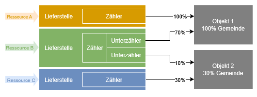

# Einführung

Die Abbildung der Strukturen ist der erste und grundlegende Schritt in der tatsächlichen Anwendung des Grünen Datenkontos. Bevor du Verbrauchsdaten erfassen kannst, musst du das Gerüst aufbauen, das alle weiteren Schritte trägt. Ohne dieses Gerüst ist eine sinnvolle und korrekte Erfassung der Verbräuche nicht möglich.

---

## Warum ist dieser Schritt so wichtig?

Stell dir das Grüne Datenkonto wie einen Aktenschrank vor: Bevor du Dokumente (in diesem Fall Verbrauchsdaten) ablegen kannst, brauchst du Ordner, Register und Beschriftungen – also die Strukturen, die alles sortiert und auffindbar machen.

- Ohne Ordner (Objekte) weißt du nicht, wo du welche Daten hinlegst.
- Ohne Register (Lieferstellen und Zähler) kannst du die Daten nicht sinnvoll zuordnen.
- Ohne Beschriftungen (klare Benennung) verlierst du den Überblick.

Erst wenn dieser Aktenschrank richtig eingerichtet ist, kannst du Verbrauchsdaten erfassen, auswerten und verwalten – ohne Chaos und mit maximaler Transparenz.

---

## Vorgehensweise: Wie beginne ich?
Es gibt drei mögliche Wege, um mit dem Grünen Datenkonto zu starten.
Jeder hat Vor- und Nachteile – wähle den, der am besten zu deiner Gemeinde und deinen Ressourcen passt.

??? tip "Option 1: Erst alle Strukturen aufbauen, dann Verbräuche erfassen"

    **Vorgehen**

    1. **Alle Objekte** (Gebäude + organisatorische Einheiten) anlegen.
    2. **Alle Lieferstellen** (Strom, Wasser, Wärme etc.) hinterlegen – inkl. Gemeindeanteile.
    3. **Alle Zähler** den Objekten und Lieferstellen zuordnen.
    4. **Erst dann** mit der Erfassung der Verbrauchswerte beginnen.

    ✅ **Vorteile**

    - **Vollständiges Gerüst** von Anfang an – keine Nacharbeit später.
    - **Konsistente Daten**, da alle Strukturen von Beginn an korrekt verknüpft sind.
    - **Bessere Übersicht**, besonders bei komplexen Gemeinden (z. B. viele Gebäude, vermietete Flächen).
  
    ❌ **Nachteile**

    - **Höherer Anfangsaufwand** – es kann dauern, bis alle Strukturen stehen.
    - **Keine schnellen Erfolge** – du siehst erst spät erste Auswertungen.

    🔹 **Empfohlen für:**

    - **Große Gemeinden** mit vielen Gebäuden/Objekten.
    - **Nutzer:innen**, die **systematisch** und **strukturiert** vorgehen möchten.
    - **Projekte mit langfristigem Fokus** (z. B. Umweltmanagement-Zertifizierung).

??? tip "Option 2: Schrittweise vorgehen – Strukturkette pro Ressource"

    **Vorgehen**

    1. **Beginne mit einer Ressource** (z. B. Strom für das Gemeindehaus).
    2. **Baue nur die dafür nötige Strukturkette auf:**
      - Objekt (Gemeindehaus) → Lieferstelle (Stadtwerke) → Zähler (Stromzähler).
    3. **Erfasse sofort die Verbrauchswerte** für diese Ressource.
    4. **Wiederhole den Prozess** für die nächste Ressource (z. B. Wasser, dann Wärme etc.).

    ✅ **Vorteile**

    - **Schnelle erste Ergebnisse** – du siehst bald erste Auswertungen.
    - **Geringerer Anfangsaufwand** – du kannst direkt loslegen.
    - **Lernkurve**: Du gewinnst **Praxiserfahrung**, während du die Strukturen aufbaust.
  
    ❌ **Nachteile**

    - **Nacharbeit möglich**, wenn sich später herausstellt, dass Strukturen unvollständig sind. 
    - **Risiko von Inkonsistenzen**, wenn Strukturen nicht einheitlich angelegt werden.

    🔹 **Empfohlen für:**

    - **Kleinere Gemeinden** mit überschaubaren Strukturen.
    - **Nutzer:innen**, die **schnell erste Daten erfassen** möchten.
    - **Pilotprojekte**, bei denen du **schrittweise Erfahrung** sammeln willst.

??? tip "Option 3: Kombinierter Ansatz – Pilotprojekt + schrittweiser Ausbau (Empfohlen!)"

    **Vorgehen**

    1. **Wähle eine Pilot-Ressource** (z. B. Strom für das Gemeindehaus) und **baue dessen Strukturkette komplett auf** (wie Option 2).
       → So lernst du das System kennen und siehst schnell erste Erfolge.
    2. **Erfasse die Verbrauchswerte für diese Ressource** und nutze die **ersten Auswertungen** für Motivation und Feedback.
    3. **Baue parallel die restlichen Strukturen auf** (wie Option 1):
       - Lege **schrittweise alle Objekte, Lieferstellen und Zähler** an.
       - Beginne mit den **wichtigsten oder einfachsten Ressourcen** (z. B. Strom, dann Wasser).

    ✅ **Vorteile**

    - **Schnelle erste Erfolge** (wie Option 2) und **langfristige Konsistenz** (wie Option 1).
    - **Praktische Lernerfahrung** durch die Pilot-Ressource.
    - **Flexibilität**: Du kannst das Tempo selbst bestimmen.
  
    ❌ **Nachteile**

    - **Erfordert etwas Planung**, um Prioritäten zu setzen.     

    🔹 **Empfohlen für:**

    - **Die meisten Gemeinden** – besonders, wenn du sowohl schnelle Ergebnisse als auch ein vollständiges System möchtest.
    - **Nutzer:innen**, die **pragmatisch und lernorientiert** vorgehen.

---

## Was gehört zu den Strukturen?

Hinsichtlich der Strukturen im Grünen Datenkonto triffst du auf dies Begriffe: 

---

**{{ term_object }}**  
{{ def_object }}    

**{{ term_deliverypoint }}**  
Übergabepunkt für eine Ressource an den Verbraucher. Die Lieferstelle hat eine eigene Adresse und ist nicht an ein einzelnes Objekt gebunden.  
In der Lieferstelle definierst du Zuordnungen: Welche Objekte beziehen welchen Anteil der Ressource aus der jeweiligen Lieferstelle? Falls deine Gemeinde nur einen anteiligen Verbrauch verursacht (z. B. 30% vom Gesamtverbrauch des Objektes "Pfarrhaus"), kannst du der Lieferstelle einen Faktor (z. B. 0,3) zuordnen.

**{{ term_meter }}**  
Einrichtung zur mengenmäßigen Erfassung des Verbrauchs. Jeder Zähler muss genau einer Lieferstelle zugeordnet werden.

**{{ term_submeter }}**  
Falls eine **Lieferstelle mehrere Objekte versorgt** (z. B. ein Hauptzähler für Strom im Gemeindehaus, der auch den Kindergarten mitversorgt) und **untergeordnete Zähler** existieren (z. B. Unterzähler für den Kindergarten), kannst du diese als **Unterzähler** dem Hauptzähler zuordnen.

---

## Welche Strukturen solltest du unterscheiden?

Der Ressourcenverbrauch einer Kirchgemeinde beschränkt sich nicht allein auf deren Gebäude und wird durch technische Zähleinrichtungen erfasst. In jeder Kirchgemeinde entsteht auch ein organisatorisch bedingter Ressourcenverbrauch, welcher - wenn relevant - im Grünen Datenkonto abgebildet werden kann. Für diese Dokumentation unterscheide ich deshalb:

??? tip "Technische Infrastruktur"

    **{{ term_object }}**  
    {{ def_object_tech }}   

    **{{ term_deliverypoint }}**  
    Position an der die Ressource an den Verbraucher übergeht: z. B. die Hausanschlüsse für Strom, Wasser, Gas oder der Tankstutzen für das Heizöl.  

    **{{ term_meter }}**  
    Einrichtung zur Erfassung des tatsächlichen Verbrauchs einer Ressource. Jeder Zähler muss einer Lieferstelle zugeordnet werden.

??? tip "Organisatorische Strukturen"

    **{{ term_object }}**  
    Organisatorisch gebildete Objekte können sein:
    - **Kirchgemeinde (Gesamtstruktur)**
    - ggf. der **Fuhrpark** oder 
    - die **Verwaltung**. 

    **{{ term_deliverypoint }}**  
    Als Lieferstellen treten in Erscheinung:
    - **Fahrzeuge**
    - **Kopierer** 
    - Die **Druckerei für den Gemeindebrief** 

    **{{ term_meter }}**  
    Als Zähler kannst du statistische Methoden einsetzen:  

    - **Fahrtenbuch** für die gefahrenen Kilometer
    - **Tankquittungen** für die getankten Liter an Kraftstoff
    - die **Zähleinrichtung am Kopierer** oder die **Rechnungen für Papiereinkauf**

    !!! tip "Tipp: Organisatorische Verbräuche (z. B. Dienstfahrten) lassen sich oft nicht automatisch erfassen – hier sind manuelle Eingaben (z. B. über Rechnungen oder Fahrtenbücher) nötig. Achte darauf, diese regelmäßig zu aktualisieren!"

## Nächster Schritt: Objekte anlegen

Im nächsten Schritt erkläre ich dir, wie du die Objekte anlegen kannst und worauf du achten solltest.

**[Weiter zu: Objekte anlegen →](_object.md)**
